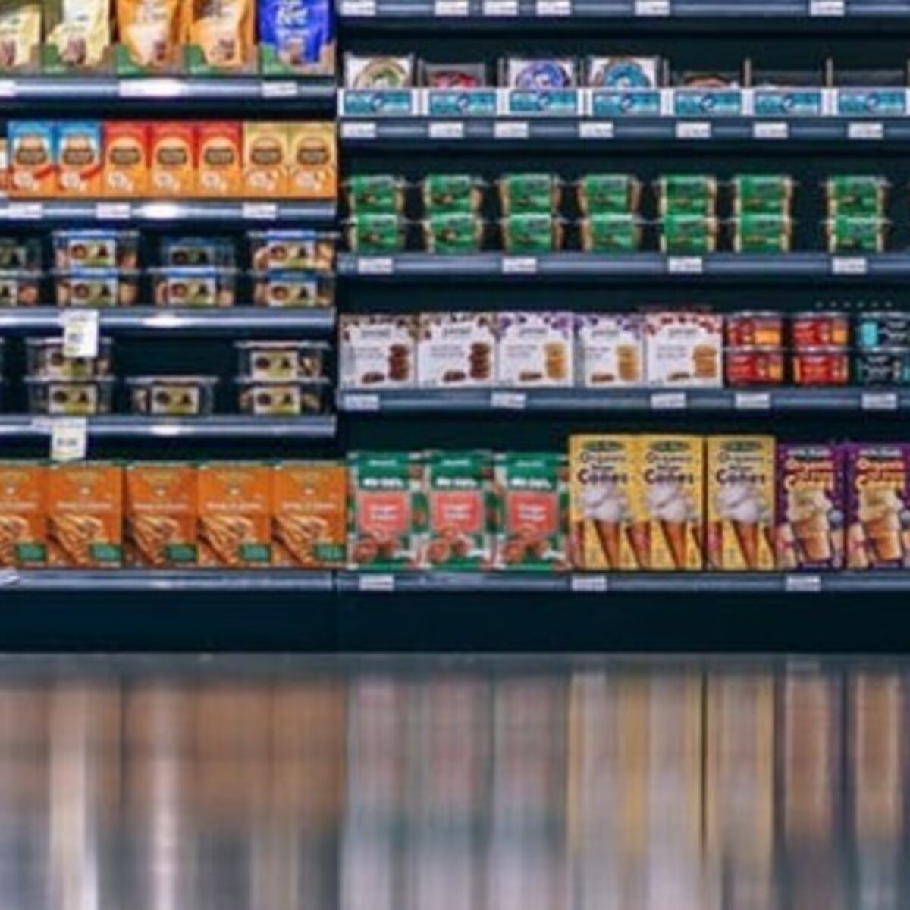

# Global-Superstore-Sales-Analysis
Global Superstore is a global online retailer based in New York, boasting a broad product catalog with the aim to be a one-stop-shop for its customers. The superstore’s clientele, hailing from 147 different countries, can browse through an endless offering with more than 10,000 products. This large selection comprises three main categories: office supplies (e.g., staples), furniture (e.g., chairs), and technology (e.g., smartphones).

# INTRODUCTION
This PowerBI project aihms to analyze **Global Superstore** dataset in order to  draw meaningful insights that would aid management in making informed decisions to improve performance and profitability

## PROBLEM STATEMENT
**_Question 1_**

a) What are the three countries that generated the highest total profit for Global Superstore in 2014?

b) For each of these three countries, find the three products with the highest total profit. Specifically, what are the products’ names and the total profit for each product?

**_Question 2_**

a) Identify the 3 subcategories with the highest average shipping cost in the United States.

**_Question 3_**

a) Assess Nigeria’s profitability (i.e., total profit) for 2014. How does it compare to other African countries?

b) What factors might be responsible for Nigeria’s poor performance? You might want to investigate shipping costs and the average discount as potential root causes.

**_Question 4_**

a) Identify the product subcategory that is the least profitable in Southeast Asia.
Assume that Southeast Asia comprises Cambodia, Indonesia, Malaysia, Myanmar
(Burma), the Philippines, Singapore, Thailand, and Vietnam.

b) Is there a specific country i n Southeast Asia where Global Superstore should stop offering the subcategory identified in 4a?

**_Question 5_**

a) Which city is the least profitable (in terms of average profit) in the United States? For this analysis, discard the cities with less than 10 Orders.

b) Why is this city’s average profit so low?

**_Question 6_**

Which product subcategory has the highest average profit in Australia?

**_Question 7_**

Who are the most valuable customers and what do they purchase?

## SKILLS/CONCEPTS DEMONSTRATED

The following PowerBI features were incorporated
- Data transformation and cleaning
- Quick measures
- Page navigation
- modelling, filters
- DAX
- Visualization

## MODELLING
Automatically derived relationships are adjusted to create required relationship

 

The model is a star schema
There are 5 dimensional tables and 1 fact table.The dimensional tables are all joined to the fact table with a one-to-many relationship

## VISUALIZATION

The report comprises 3 pages

You can interact with the report (here)(https://app.powerbi.com/view?r=eyJrIjoiOTAyNjM2NzEtYmM0OC00ZGYxLTg4ZjItODE3MmUzZDhiMTdhIiwidCI6ImZjODljMTdkLTJiZTAtNDhiZS04ZDA2LWU3YjFlNjdkZDBhMSJ9)

## ANALYSIS

### Question 1.

a)	The three countries that generated the highest total profit for Global Superstore in 2014 are 

i.	United States of America

ii.	France

iii.	Mexico

b) Based on each of the three countries above, the names of three products with the highest corresponding total profit generated are listed in the table below for each product?

1.  UNITED STATES OF AMERICA
 
   -Canon image CLASS 2200 Advanced copier   25,199.94
   
   -Nokia Smart Phone full size              18,204.04 
   
   -Fellowes PB500 Electric punch plastic comb binding machine with manual bind  14,616.39

3.  FRANCE
  
   -Canon image CLASS 2200 Advanced copier    25,199.94
   
   -Nokia Smart Phone full size               16,166.62
   
   -Motorola Smart Phone full size            12,135.86

5. MEXICO
 
  -Canon image CLASS 2200 Advanced copier    20,159.95
   
  -Nokia Smart Phone full size               17,478.18
   
  -Motorola Smart Phone full size            11,449.58

### Question 2.

a)	 3 subcategories with the highest average shipping cost in the United States includes:

i.	Tables          92.75%

ii.	Copiers         71.75%

iii.	Bookcases       64.49%

### Question 3.

a)	Comparing the total profit of the top 10 countries with the highest profits In 2014, Nigeria had a total profit of 404,561.42 making it the country with the highest total profit in that year compared to other African countries like South Africa, Egypt, DR Congo Morocco, Algeria, Tanzania, Cameroun, Angola and Ghana. 

### Question 4.

a) The product subcategory that is the least profitable in Southeast Asia is **Fasteners**.

b) Global Superstore should stop offering this product in **Cambodia** because it generated the least profit in that country

### Question 5.

a)	The least profitable City in the United States in terms of average profit is **Portage** with an average profit of 19

### Question 6

a)	The product sub-category with the highest average profit in Australia is **tables**

### Question 7

a)	The most valuable customers are the **consumers** with a total order quantity of 51.68%

       
